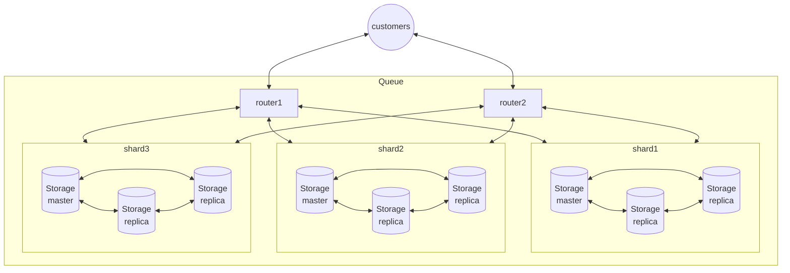

# Tarantool Sharded Queue Application

This module provides roles for the Tarantool 3 and for the Tarantool
Cartridge implementing of a distributed queue compatible with [Tarantool queue](https://github.com/tarantool/queue) (*fifiottl driver*)



## Usage in a Tarantool 3 application

You need to install the Tarantool 3.0.2+ or 3.1+.

1. Add a dependency to your application rockspec.
2. Enable `roles.sharded-queue-router` role on all sharding `router` instances.
3. Enable `roles.sharded-queue-storage` role on all sharding `storage`
   instances.
4. Configure tubes for the `roles.sharded-queue-storage` role the same for all
   storage instances.
5. Do not forget to bootstrap the vshard in your application. See
   [init.lua](./init.lua) as an example.

You could see a full example of the configuration in the [config.yaml](./config.yaml).

Be careful, it is impossible to create or drop tubes dynamically by API calls
with Tarantool 3. You need to update the role configuration instead.

## Usage in a Tarantool Cartridge application

1. Add a dependency to your application rockspec. You need to make sure that
the dependency of the Tarantool Cartridge 2.9.0 is enabled because the
`sharded-queue` does not have it by default.
2. Add roles to your application:
```init.lua
cartridge.cfg({
    ...
    roles = {        
        'sharded_queue.storage',
        'sharded_queue.api'
        ...
    },
    ...
})
```
3. Enable the `sharded_queue.storage` role on all storage nodes. Be careful,
   there should be no replicasets with `cartridge.roles.vshard-storage` role,
   but without the `sharded_queue.storage` role.
4. Queue API will be available on all nodes where the `sharded_queue.api` role
   is enabled.

## Usage as a ready-to-deploy service

Prepare `tt` environment:
```shell
tt init
git clone https://github.com/tarantool/sharded-queue instances.enabled/sharded-queue
```

Run:
```shell
tt pack --app-list sharded-queue rpm --version 1.0.0
```

Now you could install resulting package on your target servers.

For more details refer to [tt](https://github.com/tarantool/tt/)

## Usage from client perspective

The good old queue api is located on all instances of the router masters that
we launched. For a test configuration, this is one router on `localhost:3301`

```shell
tarantool@user:~/sharded_queue$ tarantool
Tarantool 1.10.3-6-gfbf53b9
type 'help' for interactive help
tarantool> netbox = require('net.box')
---
...
tarantool> queue_conn = netbox.connect('localhost:3301', {user = 'admin',password = 'secret-cluster-cookie'})
---
...
tarantool> queue_conn:call('queue.create_tube', { 'test_tube' })   
---
...
tarantool> queue_conn:call('queue.tube.test_tube:put', { 'task_1' })
---
- [3653, 'r', 'task_1']
...
tarantool> queue_conn:call('queue.tube.test_tube:take')
---
- [3653, 't', 1]
...

```

You may also set up tubes using Cartridge cluster-wide config:
```config.yml
tubes:
     tube_1:
        temporary: true
        ttl: 60
     tube_2:
        driver: my_app.my_driver
     cfg:
        metrics: false
```

Be careful, `cfg` field in a cluster-wide config acts as a configuration
value for `api.cfg()` call. These configuration options are currently
supported:

* `metrics` - enable or disable stats collection by metrics.
  metrics >= 0.11.0 is required. It is enabled by default.

## Running locally with Tarantool 3 (as an example)

Prepare `tt` environment:
```shell
tt init
git clone https://github.com/tarantool/sharded-queue instances.enabled/sharded-queue
```

Install dependencies:
```shell
tt build sharded-queue
```

Start default configuration:
```shell
tt start sharded-queue
```

To stop, say:
```shell
tt stop sharded-queue
```

## Launching tests
    
Say:

```shell
make deps
make deps-cartridge # For Tarantool < 3.
make deps-metrics # For Tarantool < 3.
make test
```

## Metrics

The module exports several metrics if the module `metrics` >= 0.11 is
installed and the feature is not disabled by the configuration.

### Router (`roles.sharded-queue-router` or `sharded_queue.api` for the Cartridge)

* Metric `tnt_sharded_queue_router_statistics_calls_total` is a counter with
  the number of requests broken down by [the type of request][queue-statistics].
  The metric has labels in the following format:

  `{name = "tube_name", state = "request_type"}`

  A list of possible request types: `done`, `take`, `kick`, `bury`, `put`,
  `delete`, `touch`, `ack`, `release`, `truncate`. The metric on the `sharded_queue.api`
  role accumulates values from all buckets.

* Metric `tnt_sharded_queue_router_statistics_tasks` is a gauge with
  the number of tasks in a queue broken down by [a task state][queue-statistics].
  The metric has labels in the following format:

  `{name = "tube_name", state = "task_state"}`

  A list of possible task states: `taken`, `buried`, `ready`, `done`,
  `delayed`, `total`. The metric on the `sharded_queue.api` role accumulates
  values from all buckets.

* Metric `tnt_sharded_queue_router_role_stats` is a [summary][metrics-summary]
  with quantiles of `sharded_queue.api` role API calls. The metric includes a
  counter of API calls and errors and has labels in the following format:

  `{name = "tube_name", method = "api_call_method", status = "ok" or "error"}`

  A list of possible call methods: `put`, `take`, `delete`, `release`, `touch`,
  `ack`, `bury`, `kick`, `peek`, `drop`, `truncate`.

### Storage (`roles.sharded-queue-storage` or `sharded_queue.storage` for the Cartridge)

* Metric `tnt_sharded_queue_storage_statistics_calls_total` is a counter with
  the number of requests broken down by [the type of request][queue-statistics].
  The metric has labels in the following format:

  `{name = "tube_name", state = "request_type"}`

  A list of possible request types: `done`, `take`, `kick`, `bury`, `put`,
  `delete`, `touch`, `ack`, `release`, `truncate`. The metric on the `sharded_queue.storage`
  role shows actual values on the instance.

* Metric `tnt_sharded_queue_storage_statistics_tasks` is a gauge with
  the number of tasks in a queue broken down by [a task state][queue-statistics].
  The metric has labels in the following format:

  `{name = "tube_name", state = "task_state"}`

  A list of possible task states: `taken`, `buried`, `ready`, `done`,
  `delayed`, `total`. The metric on the `sharded_queue.storage` role shows
  actual values on the instance.

* Metric `tnt_sharded_queue_storage_role_stats` is a [summary][metrics-summary]
  with quantiles of `sharded_queue.api` role API calls. The metric includes a
  counter of API calls and errors and has labels in the following format:

  `{name = "tube_name", method = "api_call_method", status = "ok" or "error"}`

  A list of possible call methods: `statistic`, `put`, `take`, `delete`,
  `release`, `touch`, `ack`, `bury`, `kick`, `peek`, `drop`, `truncate`.

## API extensions (compared to tarantool/queue)

* ``tube:take`` method has additional table argument ``options``. It may be used to provide additional logic in some
    drivers.
    
    Example:
    ```lua
      tube:take(3, {cumstom_driver_option='test'})
    ```

* **Logging**: There are 2 ways to log your api method calls:

    1. with the parameter `log_request` during tube creation;

    2. with the exact same parameter on each operation (each of methods (`take`, `put`, `ack`, `release`, `delete`, `touch`, `bury`, `peek`) has additional table argument ``options``).
    In this case `log_request` will override the tube's log parameter for only 1 operation.

    Examples:

    ```lua
    conn:call('queue.create_tube', { mytube, {
        log_request = true, -- log all operations
    }})

    conn:call("queue.tube.mytube:put", { data, {
        log_request = false, -- this PUT will not be logged
    }})

    conn:call("queue.tube.mytube:put", { anoter_data }) -- and this PUT will be logged
    ```

    If you use **fifottl** driver (default), you can log driver's method calls with `log_request` (log router's and storage's operations).

* You can not create or drop tubes by API calls with Tarantool 3. You need
  to update the role configuration instead.

[metrics-summary]: https://www.tarantool.io/en/doc/latest/book/monitoring/api_reference/#summary
[queue-statistics]: https://github.com/tarantool/queue?tab=readme-ov-file#getting-statistics
